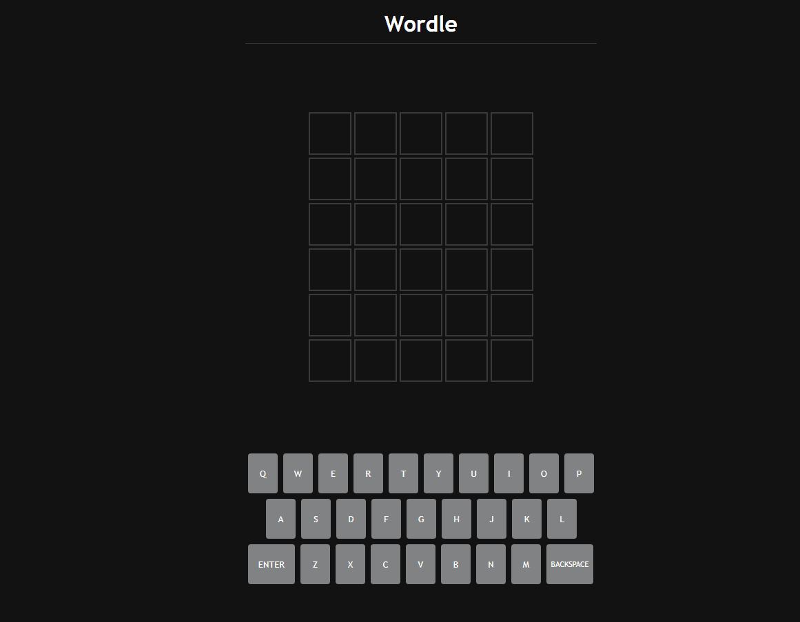

## Wordle-Clone

A clone of Wordle, the 5 letter puzzle game from the New York Times.

Made in Javascript with Node on the backend using Express + Axios and hosted on Heroku.

## APIs Used

- [Random Word Generator from RapidAPI](https://rapidapi.com/sheharyar566/api/random-words5/) - to generate 5 letter words
- [Free Dictionary API by ngocsangyem](https://github.com/ngocsangyem/freedictionaryapi) - to check whether user input is valid

## Demo

[Click here to test it out](https://floating-sands-92511.herokuapp.com/)

